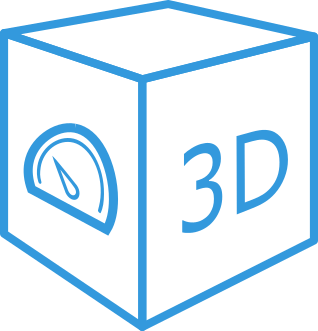

# ioBroker.vis-3dmodel

[](https://www.npmjs.com/package/iobroker.vis-3dmodel)
[](https://www.npmjs.com/package/iobroker.vis-3dmodel)


[](https://david-dm.org/Excodibur/iobroker.vis-3dmodel)
[](https://snyk.io/test/github/Excodibur/ioBroker.vis-3dmodel)

[](https://nodei.co/npm/iobroker.vis-3dmodel/)

**Tests:** 

## vis-3dmodel adapter for ioBroker

This widget allows to render interactive 3D models directly in ioBroker VIS. In editor-mode ioBroker states can also be link to certain entities like animations, or lights.


### TODO
This widget is in a very early and potentially unstable phase. Not all features have been implemented yet, so there will be a lot of bugs and "dead-ends" at the moment.

It is always a good idea to look at the files in the *examples* folder to get an idea how to setup the GLTF-file. Also better upload files to https://gltf-viewer.donmccurdy.com/ first to check if they work as expected, before working with them in the widget.
  

#### Limitations/Known-Workarounds:

- If the GLTF model loaded into the widget contains Materials with Images Textures, it will be properly displayed in **edit** mode, but not in normal end-user mode. There will be Content-Security-Policy warnings that prevent the images and therefore the model to be loaded. Workaround: Modifiy */opt/iobroker/node_modules/iobroker.vis/www/index.html* and change ```<meta  ...  content="...connect-src 'self' 'unsafe-eval' 'unsafe-inline' * ws: wss:;...">```
to ```<meta  ...  content="...connect-src 'self' 'unsafe-eval' 'unsafe-inline' * ws: wss: blob:;..."> >```. Update change to vis via *iobroker upload vis* command. Updating or installing new widgets might overwrite this setting again to. It needs to be checked if code can be changed to avoid this, or if a pull-request for vis-adapter is needed.
- Only *.gltf* files should be uploaded to VIS file-manager. At first glance it looks like *.glb* files can be uploaded as well, but when used the server does not delivery the correctly as the mime-type needed for it is not supported. However *.gltf* is basically just a large JSON-file and that can be served just fine.
- GLTF animation support seems limited. Basic Mesh transformations (scale, rotate, position) seem to work, but keyframes set to other objects attributes (e.g. power-attribute for light-source) are apparently not supported.
- If shadows are rendered for the model, there will be weird artifacts if double-sided materials (https://threejs.org/docs/#api/en/materials/Material.side) are used. In Blender this can be avoided by activating "Backface Culling" for each Material.

Some more learnings in Blender:
- Textures are not rendered for model:
-- Check if normals are inverted (red in Blender with "Face Orientation" activated in view") and fix them
-- Unwrap textures in "UV editing" mode to see if the then show up in GLTF.

## Changelog

### 0.0.1
* (Excodibur) initial release

## License
MIT License

Copyright (c) 2020 Excodibur

Permission is hereby granted, free of charge, to any person obtaining a copy
of this software and associated documentation files (the "Software"), to deal
in the Software without restriction, including without limitation the rights
to use, copy, modify, merge, publish, distribute, sublicense, and/or sell
copies of the Software, and to permit persons to whom the Software is
furnished to do so, subject to the following conditions:

The above copyright notice and this permission notice shall be included in all
copies or substantial portions of the Software.

THE SOFTWARE IS PROVIDED "AS IS", WITHOUT WARRANTY OF ANY KIND, EXPRESS OR
IMPLIED, INCLUDING BUT NOT LIMITED TO THE WARRANTIES OF MERCHANTABILITY,
FITNESS FOR A PARTICULAR PURPOSE AND NONINFRINGEMENT. IN NO EVENT SHALL THE
AUTHORS OR COPYRIGHT HOLDERS BE LIABLE FOR ANY CLAIM, DAMAGES OR OTHER
LIABILITY, WHETHER IN AN ACTION OF CONTRACT, TORT OR OTHERWISE, ARISING FROM,
OUT OF OR IN CONNECTION WITH THE SOFTWARE OR THE USE OR OTHER DEALINGS IN THE
SOFTWARE.