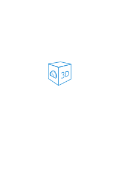

= VIS 3D Model Widget
___VERSION___
:icons: font
:sectanchors:
:title-logo-image: 
:toc:

The following document gives an overview on how to install and use the 3d Model VIS widget. Please ensure to always read the manual that corresponds to the widget version you are using, to avoid any confusion. At this point in time all functions offered by the widget are potential subject to change, so the content of this manual may differ greatly depending on your widget version.

The main idea behind this widget is, to allow experienced users to embed their own 3d visualizations (e.g. of house floors) in ioBroker VIS, while keeping them fully interactive and in-sync with the state-objects maintained in ioBroker itself. In contrast to using pre-rendered 3d models as simple JPG/PNG background images, the benefit here is that 3d models can be viewed from all angles and objects (e.g. blinds, lights, doors, etc.) within the model can be updated in real time by using animations.

At its core the 3D Model widget uses link:https://threejs.org/[ThreeJS] as render-library. 3d models itself need to be available and uploaded as link:https://www.khronos.org/gltf/[GLTF] files. If you experience glitches while loading your 3D model, please also take a look into the forum there, as there might be a lot of answers to your problem already.

If everything is setup correctly, this (or hopefully more beautiful) is how your house-model could look like:

video::media/clips/3dmodel_demo.mp4[width=960,title="Demo of 3D model widget"]

include::installation.adoc[leveloffset=1]
include::usage/usage.adoc[leveloffset=1]
