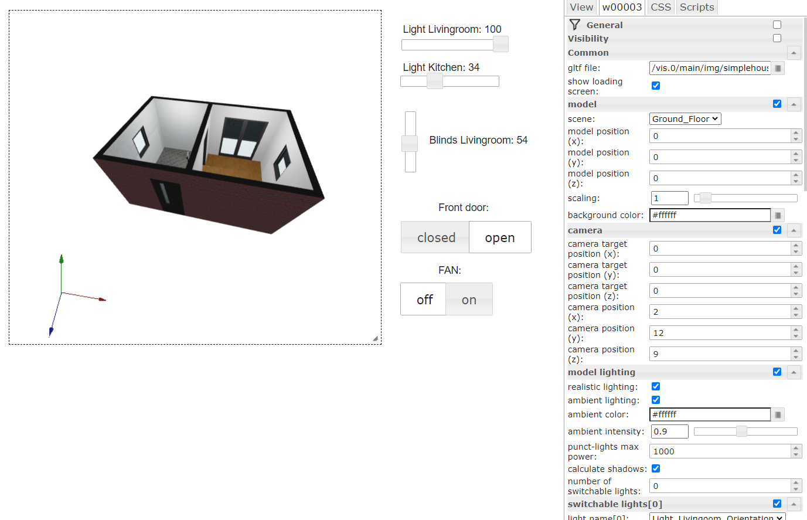

= VIS 3D Model Widget
0.0.1
:icons: font
:sectanchors:
:title-logo-image: image:../admin/logo.svg[]
:toc:

The following document gives an overview on how to install and use the 3d Model VIS widget. Please ensure to always read the manual that corresponds to the widget version you are using, to avoid any confusion. At this point in time all functions offered by the widget are potential subject to change, so the content of this manual may differ greatly depending on your widget version.

The main idea behind this widget is, to allow experienced users to embed their own 3d visualizations (e.g. of house floors) in ioBroker VIS, while keeping them fully interactive and in-sync with the state-objects maintained in ioBroker itself. In contrast to using pre-rendered 3d models as simple JPG/PNG background images, the benefit here is that 3d models can be viewed from all angles and objects (e.g. blinds, lights, doors, etc.) within the model can be updated in real time by using animations.

At its core the 3D Model widget uses link:https://threejs.org/[ThreeJS] as render-library. 3d models itself need to be available and uploaded as link:https://www.khronos.org/gltf/[GLTF] files. If you experience glitches while loading your 3D model, please also take a look into the forum there, as there might be a lot of answers to your problem already.

If everything is setup correctly, this (or hopefully more beautiful) is how your house-model could look like:

image:media/clips/3dmodel_demo.gif[title="Demo of 3D model widget"]

== Installation

At this point in time the 3dmodel widget was not added to the ioBroker stable-repository, meaning you will have to install it directly from source.

To achieve this, perform the following steps:

. It is expected that ioBroker VIS (Adapter: _Visualisation_) is already installed and a valid license key is configured. 
. In ioBroker admin GUI, go to _Adapter_ and click on the Github Icon (image:media/iobroker_icon_github.png[Github-Icon,16]) to _Install from custom URL_. In the next dialog switch to the tab _CUSTOM_ and copy link:https://github.com/Excodibur/ioBroker.vis-3dmodel[] into the field _URL or file path_. Press _Install_ to start the installation of the widget.
. If you experience issues while using the widget, please also take a look at the chapter link:#_known_issuesworkarounds[Known Issues/Workarounds].

=== Known Issues/Workarounds

The following issues were observed during development and likely will reoccur for other users, hence this section covers known workarounds for them. Some of the issues described here are already being fixed, or formally addressed, but still exist at the time of writing this document.

* The *Content Security Policy* that is enforced by ioBroker VIS by default will likely cause issues on client-side, if a GLTF model is loaded that contains Materials and Image Textures. It is correctly displayed in edit-view, but in the regular end-user view it appears as black box, since it was not properly loaded. In the web-console of your browser you will find numerous errors related to the *Content Security Policy*. ThreeJS, the 3D render library used within this widget loads some resources as *blob* data, which by default is blocked by the CSP the VIS adapter uses.
** The solution is to change the VIS config file `<iobroker-home>/node_modules/iobroker.vis/www/index.html` 

[source,html]
----
<meta http-equiv="Content-Security-Policy"
 content="default-src 'self' compiled_index.adoc compiled_index.html index.adoc index.html installation.adoc media release-documentation.adoc scripts usage 'unsafe-eval' 'unsafe-inline'; style-src 'self' 'unsafe-inline' *; img-src 'self' 'unsafe-inline' compiled_index.adoc compiled_index.html index.adoc index.html installation.adoc media release-documentation.adoc scripts usage data:; media-src 'self' 'unsafe-inline' *; connect-src 'self' 'unsafe-eval' 'unsafe-inline' compiled_index.adoc compiled_index.html index.adoc index.html installation.adoc media release-documentation.adoc scripts usage ws: wss:; script-src 'self' 'unsafe-eval' 'unsafe-inline' *">
----
to
[source,html]
----
 <meta http-equiv="Content-Security-Policy"
 content="default-src 'self' compiled_index.adoc compiled_index.html index.adoc index.html installation.adoc media release-documentation.adoc scripts usage 'unsafe-eval' 'unsafe-inline'; style-src 'self' 'unsafe-inline' *; img-src 'self' 'unsafe-inline' compiled_index.adoc compiled_index.html index.adoc index.html installation.adoc media release-documentation.adoc scripts usage data: blob:; media-src 'self' 'unsafe-inline' *; connect-src 'self' 'unsafe-eval' 'unsafe-inline' compiled_index.adoc compiled_index.html index.adoc index.html installation.adoc media release-documentation.adoc scripts usage ws: wss: blob:; script-src 'self' 'unsafe-eval' 'unsafe-inline' *"> # <1>
----
<1> Notice that for content types `img-src` and `connect-src` both *blob:* was added.

And then restart VIS via GUI, or CLI. However sometimes updating old or installing new widgets overwrites this setting again, so this is not a permanet fix. It is checked, if this can be changed in the core code.

== Usage
Once all installation steps are completed, the widget should be accessible in the VIS toolbar. The widget itself allows users to upload GLTF files containing the 3d scene information to VIS and then to embed it onto any page.

== Preparation

While the widget can render the 3d content of GTLF files, these first need to be created, exported correctly and then setup in the widget. This chapter considers preparation tasks that need to be completed, before using the widget. 

=== Creating a 3d model

There are multiple ways to generate a GLTF file, as there are exporters available for most widely used 3d-suites, including Blender, 3ds Max, Cinema4d and Maya.

This guide mainly focuses on Blender >= v2.8. Older versions of Blender can also be used, but from v2.8 on the GLTF exporter is included natively and showed the most promising results during tests.

As creating a sophisticated 3dmodel is no small task, it requires knowledge that cannot be taught within this documentation. Instead, this chapter focuses on aspects of the modeling process that are related to limitations of the widget and the 3D libraries it uses. The points described here center around modeling in Blender, but likely can be applied in some sense to other 3D-modeling tools as well.

[.float-group]
--
image:media/blender_model_create.png[Blender Create Model,400,float="right"]
Blender is a complex tool and with a good amount of know-how designers can create photo-realistic models and complex animations. But most of those effects are only possible, because professional 3D tools don't render sophisticated models in real-time and take up to minutes or hours depending on the complexity of scenes. Since this widget uses the link:https://threejs.org/[ThreeJS] library and the GLTF-format to render models in real time, it is safe to state that a lot of things that can be done with Blender simply won't work in this widget.

It is advised to take a close look at the link:[ThreeJS documentation], the link:https://threejs.org/examples[ThreeJS live examples], as well as the link:https://github.com/KhronosGroup/glTF/tree/master/specification/2.0[GLTF specification] to get an idea, what is possible.
--

In addition, there are some personal findings during development:

* Complex Material Shaders are not supported (e.g. Glass BSDF). Simpler shaders (e.g. Principled BSDF) work fine though. So no realistic light refraction through glass, but textures can be made transparent.
* A lot of Modifiers (e.g. Boolean) don't make it into the final GLTF file, unless they are applied fully.
* GLTF animation support seems limited. Basic Mesh transformations (scale, rotate, position) work, but keyframes set to other object attributes (e.g. power-attribute for light-source) are apparently not supported.
* If in the 3d Model Widget shadow-rendering is enabled, there will be weird artifacts if link:https://threejs.org/docs/#api/en/materials/Material.side[double-sided materials] are used. In Blender this can be avoided by activating "Backface Culling" for each material.
* If later in the 3d Model Widget textures are not rendered for the model:
** Check if normals are inverted (red in Blender with _Face Orientation_ activated in view") and fix them
** Unwrap textures in _UV editing_ mode to see if the then show up in GLTF.

Animations, if used, should be stored as separate NLA tracks in Blender with proper names, so they can be distiguished later in the widget. As mentioned, not all animations that can be implemented with Blender can be exported within the GLTF-file, only the ones based on simple transformations.

=== Exporting the 3d model
[.float-group]
--
image:media/blender_gltf_export.png[GLTF export dialog in Blender,200,float="right"]

The GLTF-export-dialog shown on the right hand side contains mostly the default values set by Blender. Make sure to use the right _Format_, to include _Punctual Lights_ (if you have lights in your model) and _Animations_ that are _Grouped by NLA Track_ (if you want to use animations).

Only *.gltf* files should be uploaded to VIS file-manager. At first glance it looks like *.glb* files can be uploaded as well, but when used the server does not deliver them correctly as the mime-type needed for it is not supported. However *.gltf* is basically just a large JSON-file and that can be served just fine.

It is a good idea to check the validity of your export GLTF-file, before using it in the widget. The publicly available link:https://gltf-viewer.donmccurdy.com/[online GLTF Viewer] provides an easy way to test any GLTF file you export. It is not in any way related to this widget and helps to distinguish between issues caused by the widget and issues as a result of export- or modeling-errors in your Blender project. Only if it works properly in such viewers, it will work flawlessly in the widget.
--
=== Setting up states (optional)

Although not required, one of the key features of this widget is the ability to react to states maintained in ioBroker to update the model in real time.

States (sometimes also refered to as _Datapoint_) can be used in conjunction within light-sources, as well as animations of the 3D model. Currently there are two types of states supported:
* `boolean`: Toogles entities of the 3D model.
** *Lights* are turned on or off. 
** *Animations* are played once.
* `number`: Dynamically changes entities of the 3D model.
** *Lights* are basically dimmed smoothly.
** *Animations* are played partially, depending on the state-value. 

== 3D Model Widget
The widget itself can be used like any regular widget in iobroker VIS. It should look similar to the following figure:

To work properly, a valid GLTF file needs to be uploaded to ioBroker VIS file manager (`Setup` → `File Manager...`) and referenced in the widget attributes under `General` / `Common` / `*gltf file*`.

[TIP]
====
If a exported GLTF file is valid, can be checked easily beforehand with available online tools, like link:https://gltf-viewer.donmccurdy.com/[GLTF Viewer].
====

=== Model
[.float-group]
--
image:media/3dmodel_widget_vis_settings_model.png[Widget settings - Model,300,float="right"]
The following settings are available to position and size the model properly to the viewport:

* `*scene*`: Every GLTF file should contain at least one scene containing meshes, lights and animations. Scenes in ThreeJS eqaul scenes used in Blender. In the smarthome context scenes can be used to keep data from different floors (or even rooms) separated, but still in the same model.
* `*model position x/y/z*`: Position of the model on each axis in 3D space. Setting `0` here is sufficient for most scenarios.
* `*scaling*`: This setting allows you to scale your model up or down. A similar effect can be achieved by changing the camera settings which is more complex, so this setting here is mostly there for conveniance. While the scrollbar allows the model to be scaled up to 10 times of its original size, the input box can be used to scale even higher than that.
* `*background-color*`: The default two-dimensional background color for the rendered model can be set here.
--

=== Camera
In this widget the camera always orbits around a target (aka your model), which allows for a free 360 degree rotation into every direction of 3D space. 

[.float-group]
--
image:media/3dmodel_widget_vis_settings_camera.png[Widget settings - Camera,300,float="right"]

* `*camera target position (x/y/z)*`: As you normally want the camera to exactly rotate around your model, it is advised to use the same settings here as for `Model` / `model position x/y/z`.
* `*camera position (x/y/z)*`: This is starting position of your camera "in orbit" and given distance and angle to `camera target position` decides what users will see from your model when loading the page initially. Once the widget is fully loaded, by dragging or scrolling you can change the camera position in real-time to inspect different parts of your model.
--

=== Lighting

=== Switchable Lights

=== Interactive Objects

=== Animations

When *Animations* are turned on, they will just play once, unless configured to _repeat_. Typical smarthome scenarios could be opened/closed doors, windows, or other devices that can be toggled.

With a configured _Max Value_ (the highest value the state can have) it is calculated relatively, up to which point an animation is played. E.g. a window-blind animation is played up to 50%, if the state value indicates the blinds are closed that much. If the state value decreases after that (e.g. because blinds are opened more and only 30% closed) the animation will play in reverse up to that percentage.

=== Debugging
TODO

=== Known limitations
